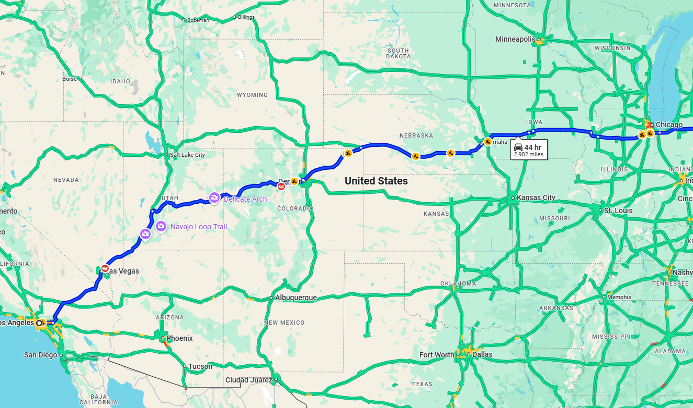

# path_optimization_Algorithm

## Plans

* Purpose: Apply Dijkstra's Algorithm on live traffic data + weather data.

* What to do?
  * How do we create graph?
  * How do we choose weight of each edgh?

* Let's focus on a static data (no need to dig in and look for live data and actually updating them in real time).
* Let's pick a path between 2 cities.
  * ex) Boston to New York.
  * might even choose further cities, and only focus on highways, to reduce number of edges to consider.
* Determining the weight of edges:
  * Base weight: distance / (speed limit) = max time taken to travel.
  * If traffic counts is higher, apply higher weight.
  * (extra) Weather data. (normal: x1, raining: x1.2, snowing: x1.5)
  * (extra) add in the factor of whether the road has traffic lights.
* Google colab to build code together:
  * https://colab.research.google.com/drive/1VlTgZ04feo7zAJzSfw8GMtCSx9Q79-FT
* where to get data:
  * https://www.reddit.com/r/gis/comments/39bfv8/is_it_possible_to_download_typical_traffic_data/?rdt=41198
  * https://www.maine.gov/mdot/traffic/counts/
  * https://geo-massdot.opendata.arcgis.com/search?tags=traffic
* make simple data set using this picture

