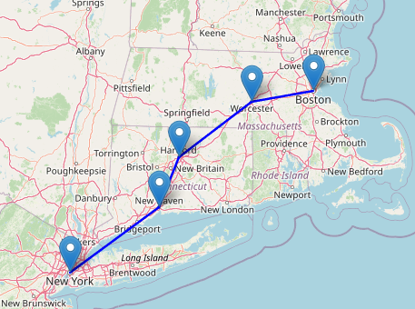

# Path Optimization Algorithm

## How to run the source code

* Following command will find the optimzed path and create a map from Boston to New York:
```
make Boston_NY
```




* The [map](src\Boston_NY.html) is created in html format.

* There is also [a colab link](https://colab.research.google.com/drive/1VlTgZ04feo7zAJzSfw8GMtCSx9Q79-FT#scrollTo=GGtjydhGliMF) for the interactive code.

## Links to Resources

* Report: [Report in pdf](docs/CS5800_final_project.pdf) and [its source file(.TeX)](src/CS5800_final_project.TeX)
* Presentation Video Link: [youtu.be/2krUuro5zhA](https://youtu.be/2krUuro5zhA)
* Presentation Slide Link: [Slides](docs/Final_presentation.pdf)
* Colab Link: [Interactive code](https://colab.research.google.com/drive/1VlTgZ04feo7zAJzSfw8GMtCSx9Q79-FT)